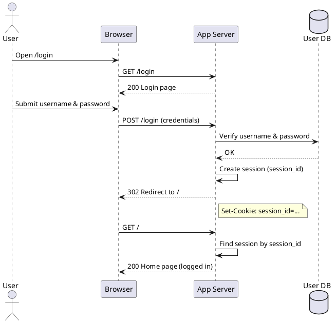
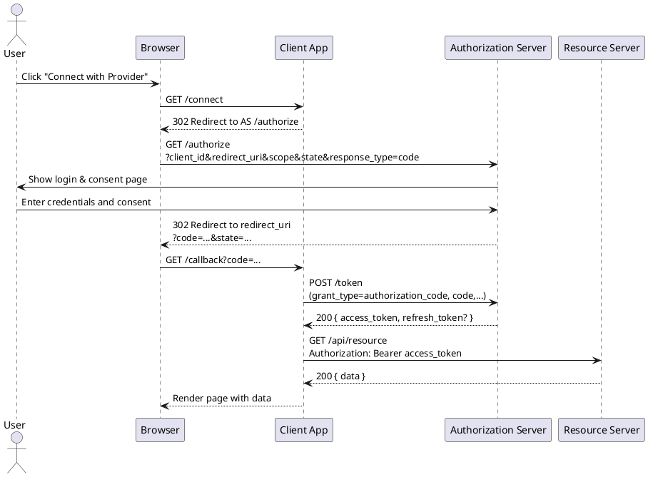

# 基础概念

- 身份认证（Authentication）：确定“你是谁”，比如登录、校验密码、短信验证码等。
- 授权（Authorization）：确定“你能做什么”，比如有哪些角色、能访问哪些 API。
- SSO（Single Sign-On，单点登录）：用户在一个地方登录后，可以无感访问多个系统。
- IdP（Identity Provider）：身份提供方，负责登录、签发凭证（如 OIDC Provider、SAML IdP）。
- 资源服务器（Resource Server）：提供 API 或资源的服务，校验 Access Token

# Session Token

最经典的“用户名 + 密码 + Session”的网站登录方式。

# Jwt Token

用户允许一个应用（Client）在一定范围内，代表自己去访问另一服务（Resource Server）的资源。

OIDC 一般指 OpenID Connect。

